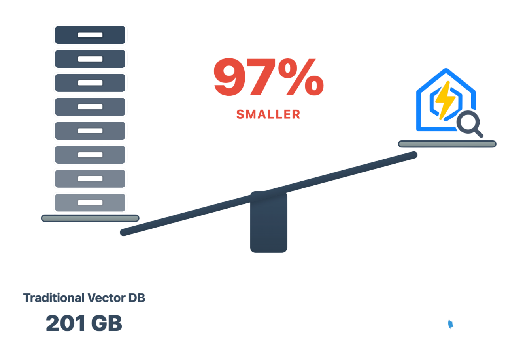
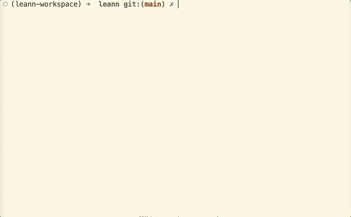
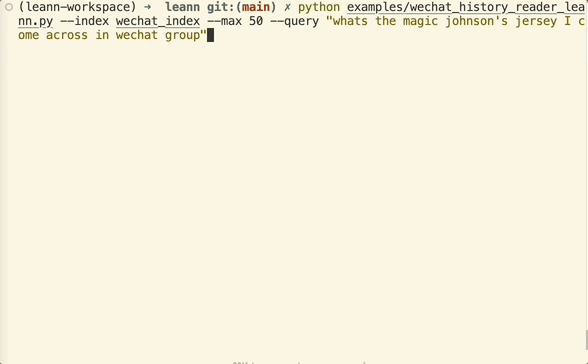
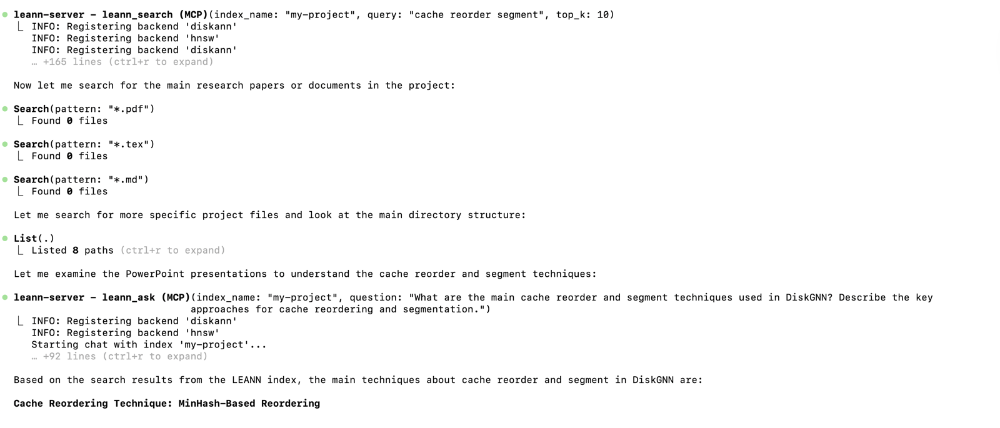
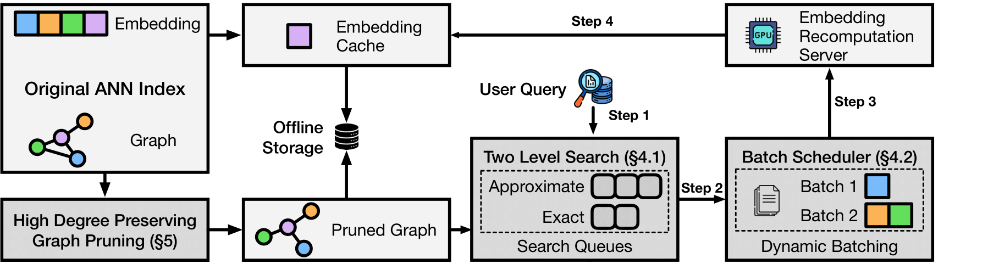

<p align="center">
  
</p>

<p align="center">
  
  
  
  
  
</p>

<h2 align="center" tabindex="-1" class="heading-element" dir="auto">
    The smallest vector index in the world. RAG Everything with LEANN!
</h2>

LEANN is an innovative vector database that democratizes personal AI. Transform your laptop into a powerful RAG system that can index and search through millions of documents while using **97% less storage** than traditional solutions **without accuracy loss**.

LEANN achieves this through *graph-based selective recomputation* with *high-degree preserving pruning*, computing embeddings on-demand instead of storing them all. [Illustration Fig →](#️-architecture--how-it-works) | [Paper →](https://arxiv.org/abs/2506.08276)

**Ready to RAG Everything?** Transform your laptop into a personal AI assistant that can semantic search your **[file system](#-personal-data-manager-process-any-documents-pdf-txt-md)**, **[emails](#-your-personal-email-secretary-rag-on-apple-mail)**, **[browser history](#-time-machine-for-the-web-rag-your-entire-browser-history)**, **[chat history](#-wechat-detective-unlock-your-golden-memories)**, **[codebase](#-claude-code-integration-transform-your-development-workflow)**\* , or external knowledge bases (i.e., 60M documents) - all on your laptop, with zero cloud costs and complete privacy.


\* Claude Code only supports basic `grep`-style keyword search. **LEANN** is a drop-in **semantic search MCP service fully compatible with Claude Code**, unlocking intelligent retrieval without changing your workflow. 🔥 Check out [the easy setup →](packages/leann-mcp/README.md)


## Why LEANN?

<p align="center">
  
</p>

> **The numbers speak for themselves:** Index 60 million text chunks in just 6GB instead of 201GB. From emails to browser history, everything fits on your laptop. [See detailed benchmarks for different applications below ↓](#-storage-comparison)


🔒 **Privacy:** Your data never leaves your laptop. No OpenAI, no cloud, no "terms of service".

🪶 **Lightweight:** Graph-based recomputation eliminates heavy embedding storage, while smart graph pruning and CSR format minimize graph storage overhead. Always less storage, less memory usage!

📦 **Portable:** Transfer your entire knowledge base between devices (even with others) with minimal cost - your personal AI memory travels with you.

📈 **Scalability:** Handle messy personal data that would crash traditional vector DBs, easily managing your growing personalized data and agent generated memory!

✨ **No Accuracy Loss:** Maintain the same search quality as heavyweight solutions while using 97% less storage.

## Installation

### 📦 Prerequisites: Install uv

[Install uv](https://docs.astral.sh/uv/getting-started/installation/#installation-methods) first if you don't have it. Typically, you can install it with:

```bash
curl -LsSf https://astral.sh/uv/install.sh | sh
```

### 🚀 Quick Install

Clone the repository to access all examples and try amazing applications,

```bash
git clone https://github.com/yichuan-w/LEANN.git leann
cd leann
```

and install LEANN from [PyPI](https://pypi.org/project/leann/) to run them immediately:

```bash
uv venv
source .venv/bin/activate
uv pip install leann
```
<!--
> Low-resource? See “Low-resource setups” in the [Configuration Guide](docs/configuration-guide.md#low-resource-setups). -->

<details>
<summary>
<strong>🔧 Build from Source (Recommended for development)</strong>
</summary>


```bash
git clone https://github.com/yichuan-w/LEANN.git leann
cd leann
git submodule update --init --recursive
```

**macOS:**

Note: DiskANN requires MacOS 13.3 or later.

```bash
brew install libomp boost protobuf zeromq pkgconf
uv sync --extra diskann
```

**Linux (Ubuntu/Debian):**

Note: On Ubuntu 20.04, you may need to build a newer Abseil and pin Protobuf (e.g., v3.20.x) for building DiskANN. See [Issue #30](https://github.com/yichuan-w/LEANN/issues/30) for a step-by-step note.

You can manually install [Intel oneAPI MKL](https://www.intel.com/content/www/us/en/developer/tools/oneapi/onemkl.html) instead of `libmkl-full-dev` for DiskANN. You can also use `libopenblas-dev` for building HNSW only, by removing `--extra diskann` in the command below.

```bash
sudo apt-get update && sudo apt-get install -y \
  libomp-dev libboost-all-dev protobuf-compiler libzmq3-dev \
  pkg-config libabsl-dev libaio-dev libprotobuf-dev \
  libmkl-full-dev

uv sync --extra diskann
```

**Linux (Arch Linux):**

```bash
sudo pacman -Syu && sudo pacman -S --needed base-devel cmake pkgconf git gcc \
  boost boost-libs protobuf abseil-cpp libaio zeromq

# For MKL in DiskANN
sudo pacman -S --needed base-devel git
git clone https://aur.archlinux.org/paru-bin.git
cd paru-bin && makepkg -si
paru -S intel-oneapi-mkl intel-oneapi-compiler
source /opt/intel/oneapi/setvars.sh

uv sync --extra diskann
```

**Linux (RHEL / CentOS Stream / Oracle / Rocky / AlmaLinux):**

See [Issue #50](https://github.com/yichuan-w/LEANN/issues/50) for more details.

```bash
sudo dnf groupinstall -y "Development Tools"
sudo dnf install -y libomp-devel boost-devel protobuf-compiler protobuf-devel \
  abseil-cpp-devel libaio-devel zeromq-devel pkgconf-pkg-config

# For MKL in DiskANN
sudo dnf install -y intel-oneapi-mkl intel-oneapi-mkl-devel \
  intel-oneapi-openmp || sudo dnf install -y intel-oneapi-compiler
source /opt/intel/oneapi/setvars.sh

uv sync --extra diskann
```

</details>


## Quick Start

Our declarative API makes RAG as easy as writing a config file.

Check out [demo.ipynb](demo.ipynb) or [](https://colab.research.google.com/github/yichuan-w/LEANN/blob/main/demo.ipynb)

```python
from leann import LeannBuilder, LeannSearcher, LeannChat
from pathlib import Path
INDEX_PATH = str(Path("./").resolve() / "demo.leann")

# Build an index
builder = LeannBuilder(backend_name="hnsw")
builder.add_text("LEANN saves 97% storage compared to traditional vector databases.")
builder.add_text("Tung Tung Tung Sahur called—they need their banana‑crocodile hybrid back")
builder.build_index(INDEX_PATH)

# Search
searcher = LeannSearcher(INDEX_PATH)
results = searcher.search("fantastical AI-generated creatures", top_k=1)

# Chat with your data
chat = LeannChat(INDEX_PATH, llm_config={"type": "hf", "model": "Qwen/Qwen3-0.6B"})
response = chat.ask("How much storage does LEANN save?", top_k=1)
```

## RAG on Everything!

LEANN supports RAG on various data sources including documents (`.pdf`, `.txt`, `.md`), Apple Mail, Google Search History, WeChat, and more.


### Generation Model Setup

LEANN supports multiple LLM providers for text generation (OpenAI API, HuggingFace, Ollama).

<details>
<summary><strong>🔑 OpenAI API Setup (Default)</strong></summary>

Set your OpenAI API key as an environment variable:

```bash
export OPENAI_API_KEY="your-api-key-here"
```

</details>

<details>
<summary><strong>🔧 Ollama Setup (Recommended for full privacy)</strong></summary>

**macOS:**

First, [download Ollama for macOS](https://ollama.com/download/mac).

```bash
# Pull a lightweight model (recommended for consumer hardware)
ollama pull llama3.2:1b
```

**Linux:**

```bash
# Install Ollama
curl -fsSL https://ollama.ai/install.sh | sh

# Start Ollama service manually
ollama serve &

# Pull a lightweight model (recommended for consumer hardware)
ollama pull llama3.2:1b
```

</details>


## ⭐ Flexible Configuration

LEANN provides flexible parameters for embedding models, search strategies, and data processing to fit your specific needs.

📚 **Need configuration best practices?** Check our [Configuration Guide](docs/configuration-guide.md) for detailed optimization tips, model selection advice, and solutions to common issues like slow embeddings or poor search quality.

<details>
<summary><strong>📋 Click to expand: Common Parameters (Available in All Examples)</strong></summary>

All RAG examples share these common parameters. **Interactive mode** is available in all examples - simply run without `--query` to start a continuous Q&A session where you can ask multiple questions. Type 'quit' to exit.

```bash
# Core Parameters (General preprocessing for all examples)
--index-dir DIR              # Directory to store the index (default: current directory)
--query "YOUR QUESTION"      # Single query mode. Omit for interactive chat (type 'quit' to exit), and now you can play with your index interactively
--max-items N                # Limit data preprocessing (default: -1, process all data)
--force-rebuild              # Force rebuild index even if it exists

# Embedding Parameters
--embedding-model MODEL      # e.g., facebook/contriever, text-embedding-3-small, mlx-community/Qwen3-Embedding-0.6B-8bit or nomic-embed-text
--embedding-mode MODE        # sentence-transformers, openai, mlx, or ollama

# LLM Parameters (Text generation models)
--llm TYPE                   # LLM backend: openai, ollama, or hf (default: openai)
--llm-model MODEL            # Model name (default: gpt-4o) e.g., gpt-4o-mini, llama3.2:1b, Qwen/Qwen2.5-1.5B-Instruct
--thinking-budget LEVEL      # Thinking budget for reasoning models: low/medium/high (supported by o3, o3-mini, GPT-Oss:20b, and other reasoning models)

# Search Parameters
--top-k N                    # Number of results to retrieve (default: 20)
--search-complexity N        # Search complexity for graph traversal (default: 32)

# Chunking Parameters
--chunk-size N               # Size of text chunks (default varies by source: 256 for most, 192 for WeChat)
--chunk-overlap N            # Overlap between chunks (default varies: 25-128 depending on source)

# Index Building Parameters
--backend-name NAME          # Backend to use: hnsw or diskann (default: hnsw)
--graph-degree N             # Graph degree for index construction (default: 32)
--build-complexity N         # Build complexity for index construction (default: 64)
--compact / --no-compact     # Use compact storage (default: true). Must be `no-compact` for `no-recompute` build.
--recompute / --no-recompute # Enable/disable embedding recomputation (default: enabled). Should not do a `no-recompute` search in a `recompute` build.
```

</details>

### 📄 Personal Data Manager: Process Any Documents (`.pdf`, `.txt`, `.md`)!

Ask questions directly about your personal PDFs, documents, and any directory containing your files!

<p align="center">
  
</p>

The example below asks a question about summarizing our paper (uses default data in `data/`, which is a directory with diverse data sources: two papers, Pride and Prejudice, and a Technical report about LLM in Huawei in Chinese), and this is the **easiest example** to run here:

```bash
source .venv/bin/activate # Don't forget to activate the virtual environment
python -m apps.document_rag --query "What are the main techniques LEANN explores?"
```

<details>
<summary><strong>📋 Click to expand: Document-Specific Arguments</strong></summary>

#### Parameters
```bash
--data-dir DIR           # Directory containing documents to process (default: data)
--file-types .ext .ext   # Filter by specific file types (optional - all LlamaIndex supported types if omitted)
```

#### Example Commands
```bash
# Process all documents with larger chunks for academic papers
python -m apps.document_rag --data-dir "~/Documents/Papers" --chunk-size 1024

# Filter only markdown and Python files with smaller chunks
python -m apps.document_rag --data-dir "./docs" --chunk-size 256 --file-types .md .py

# Enable AST-aware chunking for code files
python -m apps.document_rag --enable-code-chunking --data-dir "./my_project"

# Or use the specialized code RAG for better code understanding
python -m apps.code_rag --repo-dir "./my_codebase" --query "How does authentication work?"
```

</details>

### 📧 Your Personal Email Secretary: RAG on Apple Mail!

> **Note:** The examples below currently support macOS only. Windows support coming soon.


<p align="center">
  
</p>

Before running the example below, you need to grant full disk access to your terminal/VS Code in System Preferences → Privacy & Security → Full Disk Access.

```bash
python -m apps.email_rag --query "What's the food I ordered by DoorDash or Uber Eats mostly?"
```
**780K email chunks → 78MB storage.** Finally, search your email like you search Google.

<details>
<summary><strong>📋 Click to expand: Email-Specific Arguments</strong></summary>

#### Parameters
```bash
--mail-path PATH         # Path to specific mail directory (auto-detects if omitted)
--include-html          # Include HTML content in processing (useful for newsletters)
```

#### Example Commands
```bash
# Search work emails from a specific account
python -m apps.email_rag --mail-path "~/Library/Mail/V10/WORK_ACCOUNT"

# Find all receipts and order confirmations (includes HTML)
python -m apps.email_rag --query "receipt order confirmation invoice" --include-html
```

</details>

<details>
<summary><strong>📋 Click to expand: Example queries you can try</strong></summary>

Once the index is built, you can ask questions like:
- "Find emails from my boss about deadlines"
- "What did John say about the project timeline?"
- "Show me emails about travel expenses"
</details>

### 🔍 Time Machine for the Web: RAG Your Entire Chrome Browser History!

<p align="center">
  
</p>

```bash
python -m apps.browser_rag --query "Tell me my browser history about machine learning?"
```
**38K browser entries → 6MB storage.** Your browser history becomes your personal search engine.

<details>
<summary><strong>📋 Click to expand: Browser-Specific Arguments</strong></summary>

#### Parameters
```bash
--chrome-profile PATH    # Path to Chrome profile directory (auto-detects if omitted)
```

#### Example Commands
```bash
# Search academic research from your browsing history
python -m apps.browser_rag --query "arxiv papers machine learning transformer architecture"

# Track competitor analysis across work profile
python -m apps.browser_rag --chrome-profile "~/Library/Application Support/Google/Chrome/Work Profile" --max-items 5000
```

</details>

<details>
<summary><strong>📋 Click to expand: How to find your Chrome profile</strong></summary>

The default Chrome profile path is configured for a typical macOS setup. If you need to find your specific Chrome profile:

1. Open Terminal
2. Run: `ls ~/Library/Application\ Support/Google/Chrome/`
3. Look for folders like "Default", "Profile 1", "Profile 2", etc.
4. Use the full path as your `--chrome-profile` argument

**Common Chrome profile locations:**
- macOS: `~/Library/Application Support/Google/Chrome/Default`
- Linux: `~/.config/google-chrome/Default`

</details>

<details>
<summary><strong>💬 Click to expand: Example queries you can try</strong></summary>

Once the index is built, you can ask questions like:

- "What websites did I visit about machine learning?"
- "Find my search history about programming"
- "What YouTube videos did I watch recently?"
- "Show me websites I visited about travel planning"

</details>

### 💬 WeChat Detective: Unlock Your Golden Memories!

<p align="center">
  
</p>

```bash
python -m apps.wechat_rag --query "Show me all group chats about weekend plans"
```
**400K messages → 64MB storage** Search years of chat history in any language.


<details>
<summary><strong>🔧 Click to expand: Installation Requirements</strong></summary>

First, you need to install the [WeChat exporter](https://github.com/sunnyyoung/WeChatTweak-CLI),

```bash
brew install sunnyyoung/repo/wechattweak-cli
```

or install it manually (if you have issues with Homebrew):

```bash
sudo packages/wechat-exporter/wechattweak-cli install
```

**Troubleshooting:**
- **Installation issues**: Check the [WeChatTweak-CLI issues page](https://github.com/sunnyyoung/WeChatTweak-CLI/issues/41)
- **Export errors**: If you encounter the error below, try restarting WeChat
  ```bash
  Failed to export WeChat data. Please ensure WeChat is running and WeChatTweak is installed.
  Failed to find or export WeChat data. Exiting.
  ```
</details>

<details>
<summary><strong>📋 Click to expand: WeChat-Specific Arguments</strong></summary>

#### Parameters
```bash
--export-dir DIR         # Directory to store exported WeChat data (default: wechat_export_direct)
--force-export          # Force re-export even if data exists
```

#### Example Commands
```bash
# Search for travel plans discussed in group chats
python -m apps.wechat_rag --query "travel plans" --max-items 10000

# Re-export and search recent chats (useful after new messages)
python -m apps.wechat_rag --force-export --query "work schedule"
```

</details>

<details>
<summary><strong>💬 Click to expand: Example queries you can try</strong></summary>

Once the index is built, you can ask questions like:

- "我想买魔术师约翰逊的球衣，给我一些对应聊天记录?" (Chinese: Show me chat records about buying Magic Johnson's jersey)

</details>

### 🚀 Claude Code Integration: Transform Your Development Workflow!

<details>
<summary><strong>NEW!! AST‑Aware Code Chunking</strong></summary>

LEANN features intelligent code chunking that preserves semantic boundaries (functions, classes, methods) for Python, Java, C#, and TypeScript, improving code understanding compared to text-based chunking.

📖 Read the [AST Chunking Guide →](docs/ast_chunking_guide.md)

</details>

**The future of code assistance is here.** Transform your development workflow with LEANN's native MCP integration for Claude Code. Index your entire codebase and get intelligent code assistance directly in your IDE.

**Key features:**
- 🔍 **Semantic code search** across your entire project, fully local index and lightweight
- 🧠 **AST-aware chunking** preserves code structure (functions, classes)
- 📚 **Context-aware assistance** for debugging and development
- 🚀 **Zero-config setup** with automatic language detection

```bash
# Install LEANN globally for MCP integration
uv tool install leann-core --with leann
claude mcp add --scope user leann-server -- leann_mcp
# Setup is automatic - just start using Claude Code!
```
Try our fully agentic pipeline with auto query rewriting, semantic search planning, and more:



**🔥 Ready to supercharge your coding?** [Complete Setup Guide →](packages/leann-mcp/README.md)

## 🖥️ Command Line Interface

LEANN includes a powerful CLI for document processing and search. Perfect for quick document indexing and interactive chat.

### Installation

If you followed the Quick Start, `leann` is already installed in your virtual environment:
```bash
source .venv/bin/activate
leann --help
```

**To make it globally available:**
```bash
# Install the LEANN CLI globally using uv tool
uv tool install leann-core --with leann


# Now you can use leann from anywhere without activating venv
leann --help
```

> **Note**: Global installation is required for Claude Code integration. The `leann_mcp` server depends on the globally available `leann` command.


### Usage Examples

```bash
# build from a specific directory, and my_docs is the index name(Here you can also build from multiple dict or multiple files)
leann build my-docs --docs ./your_documents

# Search your documents
leann search my-docs "machine learning concepts"

# Interactive chat with your documents
leann ask my-docs --interactive

# List all your indexes
leann list

# Remove an index
leann remove my-docs
```

**Key CLI features:**
- Auto-detects document formats (PDF, TXT, MD, DOCX, PPTX + code files)
- **🧠 AST-aware chunking** for Python, Java, C#, TypeScript files
- Smart text chunking with overlap for all other content
- Multiple LLM providers (Ollama, OpenAI, HuggingFace)
- Organized index storage in `.leann/indexes/` (project-local)
- Support for advanced search parameters

<details>
<summary><strong>📋 Click to expand: Complete CLI Reference</strong></summary>

You can use `leann --help`, or `leann build --help`, `leann search --help`, `leann ask --help`, `leann list --help`, `leann remove --help` to get the complete CLI reference.

**Build Command:**
```bash
leann build INDEX_NAME --docs DIRECTORY|FILE [DIRECTORY|FILE ...] [OPTIONS]

Options:
  --backend {hnsw,diskann}     Backend to use (default: hnsw)
  --embedding-model MODEL      Embedding model (default: facebook/contriever)
  --graph-degree N             Graph degree (default: 32)
  --complexity N               Build complexity (default: 64)
  --force                      Force rebuild existing index
  --compact / --no-compact     Use compact storage (default: true). Must be `no-compact` for `no-recompute` build.
  --recompute / --no-recompute Enable recomputation (default: true)
```

**Search Command:**
```bash
leann search INDEX_NAME QUERY [OPTIONS]

Options:
  --top-k N                     Number of results (default: 5)
  --complexity N                Search complexity (default: 64)
  --recompute / --no-recompute  Enable/disable embedding recomputation (default: enabled). Should not do a `no-recompute` search in a `recompute` build.
  --pruning-strategy {global,local,proportional}
```

**Ask Command:**
```bash
leann ask INDEX_NAME [OPTIONS]

Options:
  --llm {ollama,openai,hf}    LLM provider (default: ollama)
  --model MODEL               Model name (default: qwen3:8b)
  --interactive              Interactive chat mode
  --top-k N                  Retrieval count (default: 20)
```

**List Command:**
```bash
leann list

# Lists all indexes across all projects with status indicators:
# ✅ - Index is complete and ready to use
# ❌ - Index is incomplete or corrupted
# 📁 - CLI-created index (in .leann/indexes/)
# 📄 - App-created index (*.leann.meta.json files)
```

**Remove Command:**
```bash
leann remove INDEX_NAME [OPTIONS]

Options:
  --force, -f    Force removal without confirmation

# Smart removal: automatically finds and safely removes indexes
# - Shows all matching indexes across projects
# - Requires confirmation for cross-project removal
# - Interactive selection when multiple matches found
# - Supports both CLI and app-created indexes
```

</details>

## 🚀 Advanced Features

### 🎯 Metadata Filtering

LEANN supports a simple metadata filtering system to enable sophisticated use cases like document filtering by date/type, code search by file extension, and content management based on custom criteria.

```python
# Add metadata during indexing
builder.add_text(
    "def authenticate_user(token): ...",
    metadata={"file_extension": ".py", "lines_of_code": 25}
)

# Search with filters
results = searcher.search(
    query="authentication function",
    metadata_filters={
        "file_extension": {"==": ".py"},
        "lines_of_code": {"<": 100}
    }
)
```

**Supported operators**: `==`, `!=`, `<`, `<=`, `>`, `>=`, `in`, `not_in`, `contains`, `starts_with`, `ends_with`, `is_true`, `is_false`

📖 **[Complete Metadata filtering guide →](docs/metadata_filtering.md)**

## 🏗️ Architecture & How It Works

<p align="center">
  
</p>

**The magic:** Most vector DBs store every single embedding (expensive). LEANN stores a pruned graph structure (cheap) and recomputes embeddings only when needed (fast).

**Core techniques:**
- **Graph-based selective recomputation:** Only compute embeddings for nodes in the search path
- **High-degree preserving pruning:** Keep important "hub" nodes while removing redundant connections
- **Dynamic batching:** Efficiently batch embedding computations for GPU utilization
- **Two-level search:** Smart graph traversal that prioritizes promising nodes

**Backends:**
- **HNSW** (default): Ideal for most datasets with maximum storage savings through full recomputation
- **DiskANN**: Advanced option with superior search performance, using PQ-based graph traversal with real-time reranking for the best speed-accuracy trade-off

## Benchmarks

**[DiskANN vs HNSW Performance Comparison →](benchmarks/diskann_vs_hnsw_speed_comparison.py)** - Compare search performance between both backends

**[Simple Example: Compare LEANN vs FAISS →](benchmarks/compare_faiss_vs_leann.py)** - See storage savings in action

### 📊 Storage Comparison

| System | DPR (2.1M) | Wiki (60M) | Chat (400K) | Email (780K) | Browser (38K) |
|--------|-------------|------------|-------------|--------------|---------------|
| Traditional vector database (e.g., FAISS) | 3.8 GB      | 201 GB     | 1.8 GB     | 2.4 GB      | 130 MB        |
| LEANN  | 324 MB      | 6 GB       | 64 MB       | 79 MB       | 6.4 MB        |
| Savings| 91%         | 97%        | 97%         | 97%         | 95%           |


## Reproduce Our Results

```bash
uv pip install -e ".[dev]"  # Install dev dependencies
python benchmarks/run_evaluation.py    # Will auto-download evaluation data and run benchmarks
python benchmarks/run_evaluation.py benchmarks/data/indices/rpj_wiki/rpj_wiki --num-queries 2000    # After downloading data, you can run the benchmark with our biggest index
```

The evaluation script downloads data automatically on first run. The last three results were tested with partial personal data, and you can reproduce them with your own data!
## 🔬 Paper

If you find Leann useful, please cite:

**[LEANN: A Low-Storage Vector Index](https://arxiv.org/abs/2506.08276)**

```bibtex
@misc{wang2025leannlowstoragevectorindex,
      title={LEANN: A Low-Storage Vector Index},
      author={Yichuan Wang and Shu Liu and Zhifei Li and Yongji Wu and Ziming Mao and Yilong Zhao and Xiao Yan and Zhiying Xu and Yang Zhou and Ion Stoica and Sewon Min and Matei Zaharia and Joseph E. Gonzalez},
      year={2025},
      eprint={2506.08276},
      archivePrefix={arXiv},
      primaryClass={cs.DB},
      url={https://arxiv.org/abs/2506.08276},
}
```

## ✨ [Detailed Features →](docs/features.md)

## 🤝 [CONTRIBUTING →](docs/CONTRIBUTING.md)


## ❓ [FAQ →](docs/faq.md)


## 📈 [Roadmap →](docs/roadmap.md)

## 📄 License

MIT License - see [LICENSE](LICENSE) for details.

## 🙏 Acknowledgments

Core Contributors: [Yichuan Wang](https://yichuan-w.github.io/) & [Zhifei Li](https://github.com/andylizf).

Active Contributors: [Gabriel Dehan](https://github.com/gabriel-dehan)


We welcome more contributors! Feel free to open issues or submit PRs.

This work is done at [**Berkeley Sky Computing Lab**](https://sky.cs.berkeley.edu/).

## Star History

[](https://www.star-history.com/#yichuan-w/LEANN&Date)
<p align="center">
  <strong>⭐ Star us on GitHub if Leann is useful for your research or applications!</strong>
</p>

<p align="center">
  Made with ❤️ by the Leann team
</p>
