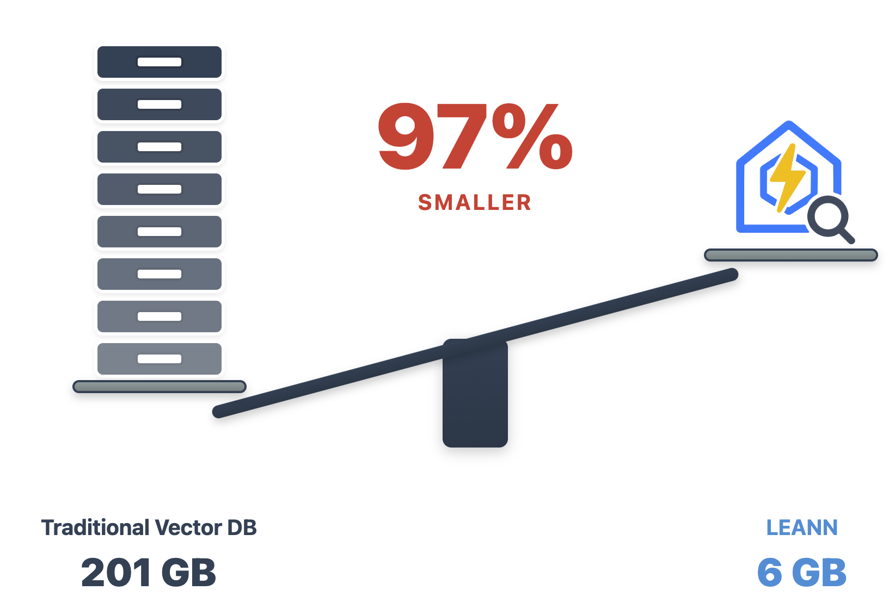

<p align="center">
  
</p>

<p align="center">
  
  
  
</p>

<h2 align="center" tabindex="-1" class="heading-element" dir="auto">
    The smallest vector index in the world. RAG Everything with LEANN!
</h2>

LEANN is a revolutionary vector database that democratizes personal AI. Transform your laptop into a powerful RAG system that can index and search through millions of documents while using **[97% less storage]** than traditional solutions **without accuracy loss**.

LEANN achieves this through *graph-based selective recomputation* with *high-degree preserving pruning*, computing embeddings on-demand instead of storing them all. [Illustration →](#️-architecture--how-it-works) | [Paper →](https://arxiv.org/abs/2506.08276)

**Ready to RAG Everything?** Transform your laptop into a personal AI assistant that can search your **[file system](#process-any-documents-pdf-txt-md)**, **[emails](#search-your-entire-life)**, **[browser history](#time-machine-for-the-web)**, **[chat history](#wechat-detective)**, or external knowledge bases (i.e., 60M documents) - all on your laptop, with zero cloud costs and complete privacy.


## Why LEANN?

<p align="center">
  
</p>

**The numbers speak for themselves:** Index 60 million Wikipedia articles in just 6GB instead of 201GB. From emails to browser history, everything fits on your laptop. [See detailed benchmarks below ↓](#storage-usage-comparison)

## Why This Matters

🔒 **Privacy:** Your data never leaves your laptop. No OpenAI, no cloud, no "terms of service".

🪶 **Lightweight:** Graph-based recomputation eliminates heavy embedding storage, while smart graph pruning and CSR format minimize graph storage overhead. Always less storage, less memory usage!

📈 **Scalability:** Handle messy personal data that would crash traditional vector DBs, easily managing your growing personalized data and agent generated memory!

✨ **No Accuracy Loss:** Maintain the same search quality as heavyweight solutions while using 97% less storage.

## Quick Start in 1 minute

```bash
git clone git@github.com:yichuan-w/LEANN.git leann
cd leann
git submodule update --init --recursive
```

**macOS:**
```bash
brew install llvm libomp boost protobuf zeromq
export CC=$(brew --prefix llvm)/bin/clang
export CXX=$(brew --prefix llvm)/bin/clang++

# Install with HNSW backend (default, recommended for most users)
uv sync

# Or add DiskANN backend if you want to test more options
uv sync --extra diskann
```

**Linux (Ubuntu/Debian):**
```bash
sudo apt-get install libomp-dev libboost-all-dev protobuf-compiler libabsl-dev libmkl-full-dev libaio-dev libzmq3-dev

# Install with HNSW backend (default, recommended for most users)
uv sync

# Or add DiskANN backend if you want to test more options
uv sync --extra diskann
```

**Ollama Setup (Optional for Local LLM):**

*We support both hf-transformers and Ollama for local LLMs. Ollama is recommended for faster performance.*

*macOS:*

First, [download Ollama for macOS](https://ollama.com/download/mac).

```bash
# Pull a lightweight model (recommended for consumer hardware)
ollama pull llama3.2:1b
```

*Linux:*
```bash
# Install Ollama
curl -fsSL https://ollama.ai/install.sh | sh

# Start Ollama service manually
ollama serve &

# Pull a lightweight model (recommended for consumer hardware)
ollama pull llama3.2:1b
```

You can also replace `llama3.2:1b` to `deepseek-r1:1.5b` or `qwen3:4b` for better performance but higher memory usage.

## Dead Simple API

Just 3 lines of code. Our declarative API makes RAG as easy as writing a config file:

```python
from leann.api import LeannBuilder, LeannSearcher

# 1. Build index (no embeddings stored!)
builder = LeannBuilder(backend_name="hnsw")
builder.add_text("C# is a powerful programming language")
builder.add_text("Python is a powerful programming language")
builder.add_text("Machine learning transforms industries")  
builder.add_text("Neural networks process complex data")
builder.add_text("Leann is a great storage saving engine for RAG on your macbook")
builder.build_index("knowledge.leann")

# 2. Search with real-time embeddings
searcher = LeannSearcher("knowledge.leann")
results = searcher.search("C++ programming languages", top_k=2, recompute_beighbor_embeddings=True)
print(results)
```

**That's it.** No cloud setup, no API keys, no "fine-tuning". Just your data, your questions, your laptop.

[Try the interactive demo →](demo.ipynb)

## Wild Things You Can Do

LEANN supports RAGing a lot of data sources, like .pdf, .txt, .md, and also supports RAGing your WeChat, Google Search History, and more.

### Process Any Documents (.pdf, .txt, .md)

Above we showed the Python API, while this CLI script demonstrates the same concepts while directly processing PDFs and documents.

```bash
# Drop your PDFs, .txt, .md files into examples/data/
uv run ./examples/main_cli_example.py

# Or use python directly
source .venv/bin/activate
python ./examples/main_cli_example.py
```

Uses Ollama `qwen3:8b` by default. For other models: `--llm openai --model gpt-4o` (requires `OPENAI_API_KEY` environment variable) or `--llm hf --model Qwen/Qwen3-4B`.

**Works with any text format** - research papers, personal notes, presentations. Built with LlamaIndex for document parsing.

### Search Your Entire Life
```bash
python examples/mail_reader_leann.py
# "What did my boss say about the Christmas party last year?"
# "Find all emails from my mom about birthday plans"
```
**90K emails → 14MB.** Finally, search your email like you search Google.

<details>
<summary><strong>📋 Click to expand: Command Examples</strong></summary>

```bash
# Use default mail path (works for most macOS setups)
python examples/mail_reader_leann.py

# Run with custom index directory
python examples/mail_reader_leann.py --index-dir "./my_mail_index"

# Process all emails (may take time but indexes everything)
python examples/mail_reader_leann.py --max-emails -1

# Limit number of emails processed (useful for testing)
python examples/mail_reader_leann.py --max-emails 1000

# Run a single query
python examples/mail_reader_leann.py --query "What did my boss say about deadlines?"
```

</details>

<details>
<summary><strong>📋 Click to expand: Example queries you can try</strong></summary>

Once the index is built, you can ask questions like:
- "Find emails from my boss about deadlines"
- "What did John say about the project timeline?"
- "Show me emails about travel expenses"
</details>

### Time Machine for the Web  
```bash
python examples/google_history_reader_leann.py
# "What was that AI paper I read last month?"
# "Show me all the cooking videos I watched"
```
**38K browser entries → 6MB.** Your browser history becomes your personal search engine.

<details>
<summary><strong>📋 Click to expand: Command Examples</strong></summary>

```bash
# Use default Chrome profile (auto-finds all profiles)
python examples/google_history_reader_leann.py

# Run with custom index directory
python examples/google_history_reader_leann.py --index-dir "./my_chrome_index"

# Limit number of history entries processed (useful for testing)
python examples/google_history_reader_leann.py --max-entries 500

# Run a single query
python examples/google_history_reader_leann.py --query "What websites did I visit about machine learning?"
```

</details>

<details>
<summary><strong>📋 Click to expand: How to find your Chrome profile</strong></summary>

The default Chrome profile path is configured for a typical macOS setup. If you need to find your specific Chrome profile:

1. Open Terminal
2. Run: `ls ~/Library/Application\ Support/Google/Chrome/`
3. Look for folders like "Default", "Profile 1", "Profile 2", etc.
4. Use the full path as your `--chrome-profile` argument

**Common Chrome profile locations:**
- macOS: `~/Library/Application Support/Google/Chrome/Default`
- Linux: `~/.config/google-chrome/Default`

</details>

<details>
<summary><strong>💬 Click to expand: Example queries you can try</strong></summary>

Once the index is built, you can ask questions like:

- "What websites did I visit about machine learning?"
- "Find my search history about programming"
- "What YouTube videos did I watch recently?"
- "Show me websites I visited about travel planning"

</details>

### WeChat Detective

```bash
python examples/wechat_history_reader_leann.py
# "Show me all group chats about weekend plans"
```
**400K messages → 64MB.** Search years of chat history in any language.

<details>
<summary><strong>🔧 Click to expand: Installation Requirements</strong></summary>

First, you need to install the WeChat exporter:

```bash
sudo packages/wechat-exporter/wechattweak-cli install
```

**Troubleshooting**: If you encounter installation issues, check the [WeChatTweak-CLI issues page](https://github.com/sunnyyoung/WeChatTweak-CLI/issues/41).
</details>

<details>
<summary><strong>📋 Click to expand: Command Examples</strong></summary>

```bash
# Use default settings (recommended for first run)
python examples/wechat_history_reader_leann.py

# Run with custom export directory and wehn we run the first time, LEANN will export all chat history automatically for you
python examples/wechat_history_reader_leann.py --export-dir "./my_wechat_exports"

# Run with custom index directory
python examples/wechat_history_reader_leann.py --index-dir "./my_wechat_index"

# Limit number of chat entries processed (useful for testing)
python examples/wechat_history_reader_leann.py --max-entries 1000

# Run a single query
python examples/wechat_history_reader_leann.py --query "Show me conversations about travel plans"
```

</details>

<details>
<summary><strong>💬 Click to expand: Example queries you can try</strong></summary>

Once the index is built, you can ask questions like:

- "我想买魔术师约翰逊的球衣，给我一些对应聊天记录?" (Chinese: Show me chat records about buying Magic Johnson's jersey)

</details>


## 🏗️ Architecture & How It Works

<p align="center">
  
</p>

**The magic:** Most vector DBs store every single embedding (expensive). LEANN stores a pruned graph structure (cheap) and recomputes embeddings only when needed (fast).

**Core techniques:**
- **Graph-based selective recomputation:** Only compute embeddings for nodes in the search path
- **High-degree preserving pruning:** Keep important "hub" nodes while removing redundant connections  
- **Dynamic batching:** Efficiently batch embedding computations for GPU utilization
- **Two-level search:** Smart graph traversal that prioritizes promising nodes

**Backends:** DiskANN or HNSW - pick what works for your data size.

## Benchmarks

Run the comparison yourself:
```bash
python examples/compare_faiss_vs_leann.py
```

| System | Storage | 
|--------|---------|
| FAISS HNSW | 5.5 MB |
| LEANN | 0.5 MB |
| **Savings** | **91%** |

Same dataset, same hardware, same embedding model. LEANN just works better.

## Reproduce Our Results

```bash
uv pip install -e ".[dev]"  # Install dev dependencies
python examples/run_evaluation.py data/indices/dpr/dpr_diskann      # DPR dataset
python examples/run_evaluation.py data/indices/rpj_wiki/rpj_wiki.index  # Wikipedia
```

The evaluation script downloads data automatically on first run.

### Storage Usage Comparison

| System                | DPR (2.1M chunks) | RPJ-wiki (60M chunks) | Chat history (400K messages) | Apple emails (90K messages chunks) |Google Search History (38K entries)
|-----------------------|------------------|------------------------|-----------------------------|------------------------------|------------------------------|
| Traditional Vector DB(FAISS) | 3.8 GB           | 201 GB                 | 1.8G                     | 305.8 MB                     |130.4 MB                     |
| **LEANN**             | **324 MB**       | **6 GB**               | **64 MB**                 | **14.8 MB**                  |**6.4MB**                  |
| **Reduction**         | **91% smaller**  | **97% smaller**        | **97% smaller**             | **95% smaller**              |**95% smaller**              |

<!-- ### Memory Usage Comparison

| System          j      | DPR(2M docs)     | RPJ-wiki(60M docs)    | Chat history()   |
| --------------------- | ---------------- | ---------------- | ---------------- |
| Traditional Vector DB(LLamaindex faiss) | x GB           | x GB            | x GB           |
| **Leann**       | **xx MB** | **x GB** | **x GB** |
| **Reduction**   | **x%**  | **x%**  | **x%**  |

### Query Performance of LEANN

| Backend             | Index Size | Query Time | Recall@3 |
| ------------------- | ---------- | ---------- | --------- |
| DiskANN             | 1M docs    | xms       | 0.95      |
| HNSW                | 1M docs    | xms        | 0.95      | -->

*Benchmarks run on Apple M3 Pro 36 GB*

## 🔬 Paper

If you find Leann useful, please cite:

**[LEANN: A Low-Storage Vector Index](https://arxiv.org/abs/2506.08276)**

```bibtex
@misc{wang2025leannlowstoragevectorindex,
      title={LEANN: A Low-Storage Vector Index}, 
      author={Yichuan Wang and Shu Liu and Zhifei Li and Yongji Wu and Ziming Mao and Yilong Zhao and Xiao Yan and Zhiying Xu and Yang Zhou and Ion Stoica and Sewon Min and Matei Zaharia and Joseph E. Gonzalez},
      year={2025},
      eprint={2506.08276},
      archivePrefix={arXiv},
      primaryClass={cs.DB},
      url={https://arxiv.org/abs/2506.08276}, 
}
```

## ✨ Features

### 🔥 Core Features

- **🔄 Real-time Embeddings** - Eliminate heavy embedding storage with dynamic computation using optimized ZMQ servers and highly optimized search paradigm (overlapping and batching) with highly optimized embedding engine
- **📈 Scalable Architecture** - Handles millions of documents on consumer hardware; the larger your dataset, the more LEANN can save
- **🎯 Graph Pruning** - Advanced techniques to minimize the storage overhead of vector search to a limited footprint
- **🏗️ Pluggable Backends** - DiskANN, HNSW/FAISS with unified API

### 🛠️ Technical Highlights
- **🔄 Recompute Mode** - Highest accuracy scenarios while eliminating vector storage overhead
- **⚡ Zero-copy Operations** - Minimize IPC overhead by transferring distances instead of embeddings
- **🚀 High-throughput Embedding Pipeline** - Optimized batched processing for maximum efficiency
- **🎯 Two-level Search** - Novel coarse-to-fine search overlap for accelerated query processing (optional)
- **💾 Memory-mapped Indices** - Fast startup with raw text mapping to reduce memory overhead
- **🚀 MLX Support** - Ultra-fast recompute/build with quantized embedding models, accelerating building and search ([minimal example](test/build_mlx_index.py))

### 🎨 Developer Experience

- **Simple Python API** - Get started in minutes
- **Extensible backend system** - Easy to add new algorithms
- **Comprehensive examples** - From basic usage to production deployment

## 🤝 Contributing

We welcome contributions! Leann is built by the community, for the community.

### Ways to Contribute

- 🐛 **Bug Reports**: Found an issue? Let us know!
- 💡 **Feature Requests**: Have an idea? We'd love to hear it!
- 🔧 **Code Contributions**: PRs welcome for all skill levels
- 📖 **Documentation**: Help make Leann more accessible
- 🧪 **Benchmarks**: Share your performance results


<!-- ## ❓ FAQ

### Common Issues

#### NCCL Topology Error

**Problem**: You encounter `ncclTopoComputePaths` error during document processing:

```
ncclTopoComputePaths (system=<optimized out>, comm=comm@entry=0x5555a82fa3c0) at graph/paths.cc:688
```

**Solution**: Set these environment variables before running your script:

```bash
export NCCL_TOPO_DUMP_FILE=/tmp/nccl_topo.xml
export NCCL_DEBUG=INFO
export NCCL_DEBUG_SUBSYS=INIT,GRAPH
export NCCL_IB_DISABLE=1
export NCCL_NET_PLUGIN=none
export NCCL_SOCKET_IFNAME=ens5
``` -->

## 📈 Roadmap

### 🎯 Q2 2025

- [X] DiskANN backend with MIPS/L2/Cosine support
- [X] HNSW backend integration
- [X] Real-time embedding pipeline
- [X] Memory-efficient graph pruning

### 🚀 Q3 2025


- [ ] Advanced caching strategies
- [ ] Add contextual-retrieval https://www.anthropic.com/news/contextual-retrieval
- [ ] Add sleep-time-compute and summarize agent! to summarilze the file on computer!
- [ ] Add OpenAI recompute API

### 🌟 Q4 2025

- [ ] Integration with LangChain/LlamaIndex
- [ ] Visual similarity search
- [ ] Query rewrtiting, rerank and expansion

## 📄 License

MIT License - see [LICENSE](LICENSE) for details.

## 🙏 Acknowledgments

- **Microsoft Research** for the DiskANN algorithm
- **Meta AI** for FAISS and optimization insights
- **HuggingFace** for the transformer ecosystem
- **Our amazing contributors** who make this possible

---

<p align="center">
  <strong>⭐ Star us on GitHub if Leann is useful for your research or applications!</strong>
</p>

<p align="center">
  Made with ❤️ by the Leann team
</p>

