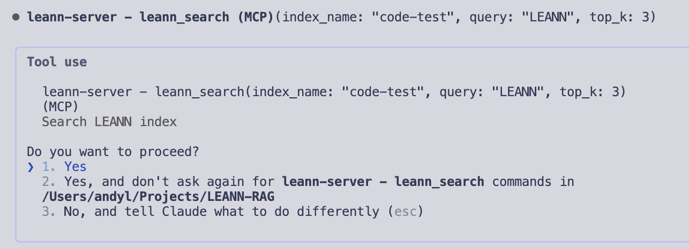

# 🔥 LEANN Claude Code Integration

Transform your development workflow with intelligent code assistance using LEANN's semantic search directly in Claude Code.

## Prerequisites

Install LEANN globally for MCP integration (with default backend):

```bash
uv tool install leann-core --with leann
```
This installs the `leann` CLI into an isolated tool environment and includes both backends so `leann build` works out-of-the-box.

## 🚀 Quick Setup

Add the LEANN MCP server to Claude Code. Choose the scope based on how widely you want it available. Below is the command to install it globally; if you prefer a local install, skip this step:

```bash
# Global (recommended): available in all projects for your user
claude mcp add --scope user leann-server -- leann_mcp
```

- `leann-server`: the display name of the MCP server in Claude Code (you can change it).
- `leann_mcp`: the Python entry point installed with LEANN that starts the MCP server.

Verify it is registered globally:

```bash
claude mcp list | cat
```

## 🛠️ Available Tools

Once connected, you'll have access to these powerful semantic search tools in Claude Code:

- **`leann_list`** - List all available indexes across your projects
- **`leann_search`** - Perform semantic searches across code and documents


## 🎯 Quick Start Example

```bash
# Add locally if you did not add it globally (current folder only; default if --scope is omitted)
claude mcp add leann-server -- leann_mcp

# Build an index for your project (change to your actual path)
# See the advanced examples below for more ways to configure indexing
# Set the index name (replace 'my-project' with your own)
leann build my-project --docs $(git ls-files)

# Start Claude Code
claude
```

## 🚀 Advanced Usage Examples to build the index

### Index Entire Git Repository
```bash
# Index all tracked files in your Git repository.
# Note: submodules are currently skipped; we can add them back if needed.
leann build my-repo --docs $(git ls-files) --embedding-mode sentence-transformers --embedding-model all-MiniLM-L6-v2 --backend hnsw

# Index only tracked Python files from Git.
leann build my-python-code --docs $(git ls-files "*.py") --embedding-mode sentence-transformers --embedding-model all-MiniLM-L6-v2 --backend hnsw

# If you encounter empty requests caused by empty files (e.g., __init__.py), exclude zero-byte files. Thanks @ww2283 for pointing [that](https://github.com/yichuan-w/LEANN/issues/48) out
leann build leann-prospec-lig --docs $(find ./src -name "*.py" -not -empty) --embedding-mode openai --embedding-model text-embedding-3-small
```

### Multiple Directories and Files
```bash
# Index multiple directories
leann build my-codebase --docs ./src ./tests ./docs ./config --embedding-mode sentence-transformers --embedding-model all-MiniLM-L6-v2 --backend hnsw

# Mix files and directories
leann build my-project --docs ./README.md ./src/ ./package.json ./docs/ --embedding-mode sentence-transformers --embedding-model all-MiniLM-L6-v2 --backend hnsw

# Specific files only
leann build my-configs --docs ./tsconfig.json ./package.json ./webpack.config.js --embedding-mode sentence-transformers --embedding-model all-MiniLM-L6-v2 --backend hnsw
```

### Advanced Git Integration
```bash
# Index recently modified files
leann build recent-changes --docs $(git diff --name-only HEAD~10..HEAD) --embedding-mode sentence-transformers --embedding-model all-MiniLM-L6-v2 --backend hnsw

# Index files matching pattern
leann build frontend --docs $(git ls-files "*.tsx" "*.ts" "*.jsx" "*.js") --embedding-mode sentence-transformers --embedding-model all-MiniLM-L6-v2 --backend hnsw

# Index documentation and config files
leann build docs-and-configs --docs $(git ls-files "*.md" "*.yml" "*.yaml" "*.json" "*.toml") --embedding-mode sentence-transformers --embedding-model all-MiniLM-L6-v2 --backend hnsw
```


## **Try this in Claude Code:**
```
Help me understand this codebase. List available indexes and search for authentication patterns.
```

<p align="center">
  
</p>

If you see a prompt asking whether to proceed with LEANN, you can now use it in your chat!

## 🧠 How It Works

The integration consists of three key components working seamlessly together:

- **`leann`** - Core CLI tool for indexing and searching (installed globally via `uv tool install`)
- **`leann_mcp`** - MCP server that wraps `leann` commands for Claude Code integration
- **Claude Code** - Calls `leann_mcp`, which executes `leann` commands and returns intelligent results

## 📁 File Support

LEANN understands **30+ file types** including:
- **Programming**: Python, JavaScript, TypeScript, Java, Go, Rust, C++, C#
- **Data**: SQL, YAML, JSON, CSV, XML
- **Documentation**: Markdown, TXT, PDF
- **And many more!**

## 💾 Storage & Organization

- **Project indexes**: Stored in `.leann/` directory (just like `.git`)
- **Global registry**: Project tracking at `~/.leann/projects.json`
- **Multi-project support**: Switch between different codebases seamlessly
- **Portable**: Transfer indexes between machines with minimal overhead

## 🗑️ Uninstalling

To remove the LEANN MCP server from Claude Code:

```bash
claude mcp remove leann-server
```
To remove LEANN
```
uv pip uninstall leann leann-backend-hnsw leann-core
```

To globally remove LEANN (for version update)
```
uv tool list | cat
uv tool uninstall leann-core
command -v leann || echo "leann gone"
command -v leann_mcp || echo "leann_mcp gone"
```
